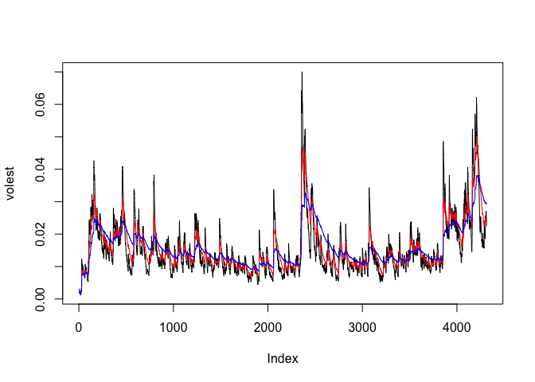

# TCP_Vol2
Marie Wallmark  
July 19, 2016  

# Preparing Financial Data
## Download the data
Load required packages


```r
Stockdata <- get.hist.quote('TCP',quote="Close")
```

```
## time series starts 1999-05-25
```

```r
length(Stockdata)
```

```
## [1] 4315
```
## Calcualte log returns

```r
TCPl <- log(lag(Stockdata)) - log(Stockdata)
length(TCPl)
```

```
## [1] 4314
```
## Calculate volatility measure

```r
TCPvol <- sd(TCPl) * sqrt(250) * 100
TCPvol
```

```
## [1] 27.65884
```
## Calculate volatilty over entire length of series for three different decay factors

```r
getVol <- function(d, logrets)
{
var = 0
lam = 0
varlist <- c()
for (r in logrets) {
lam = lam*(1 - 1/d) + 1
var = (1 - 1/lam)*var + (1/lam)*r^2
varlist <- c(varlist, var)
}
sqrt(varlist)
}
volest <- getVol(10,TCPl)
volest2 <- getVol(30,TCPl)
volest3 <- getVol(100,TCPl)
```
## Plot the results, overlaying the volitality curves on the data

```r
plot(volest,type="l")
lines(volest2,type="l",col="red")
lines(volest3, type = "l", col="blue")
```

<!-- -->

